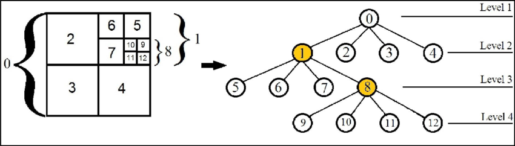

# This project demonstrates how to implement Quadtree data structures.

* A Quadtree is a tree data structure in which each node represents a two-dimensional area. A node in quadtree has four children nodes representing:

  * Northwest (NW) ~ top-left
  * Northeast (NE) ~ top-right
  * Southwest (SW) ~ bottom-left
  * Southeast (SE) ~ bottom-right
* Start from the root node represent the map area. Quadtree recursively subdivides into four smaller area until a certain condition is met, such as a maximum depth or a maximum number of points in a node. For example, when number of points in a node larger than 4, it will subdivide into four children nodes, the process continues applying for children nodes until a node has less than 4 points.

* This data structure is useful for spatial indexing, collision detection, and efficient querying of points in a two-dimensional space. Instead of searching for all points in the entire area, you can quickly narrow down which regions to look in by traversing the tree structure and only checking the points in the nodes that contains searching area.

